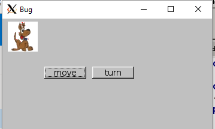
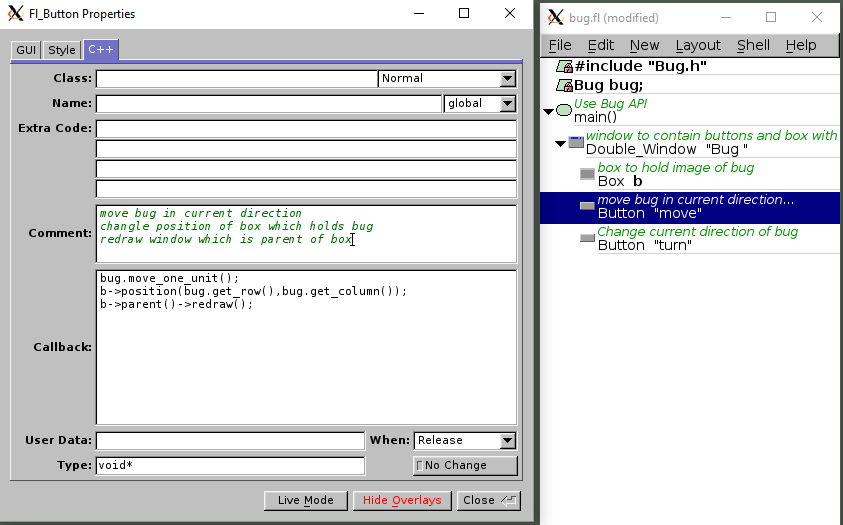

== Example of an FLTK program which uses the Bug API

Program running:

Class definition that describes the API
[source,cpp]
----
include::Bug.h[]
----

FLTK code that uses the API

Create a callback to react to the user input in the "move" button in the FLUID designer

Source code produced by FLUID in bug.cxx:
[source,cpp]
----
include::bug.cxx[lines=3..11]
----

[red]#(lot's of image data in this spot)#

[source,cpp]
----
include::bug.cxx[lines=376..417]
----

